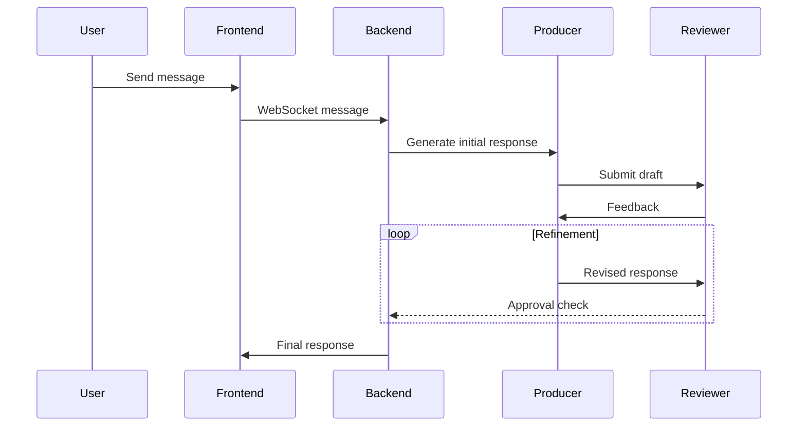

# Chat With AI Agent

## 🚀 Overview

This project is a **real-time AI chat application** that uses **Vue 3** for the frontend and **Django + Django Channels** for the backend, integrated with a **LLaMA-based multi-agent AI model** (Producer & Reviewer) for enhanced response quality.

## 📂 Directory Structure

```
nikhilagarwal204-chatwithagent/
├── client/               # Frontend (Vue 3 + Vite)
│   ├── src/
│   │   ├── components/
│   │   │   ├── ChatWidget.vue
│   │   │   └── FileMessage.vue
│   │   ├── utils/websocket.js
│   │   ├── App.vue
│   │   ├── main.js
│   │   ├── assets/styles.css
│   ├── index.html
│   ├── package.json
│   ├── vite.config.js
├── server/               # Backend (Django + ASGI WebSockets)
│   ├── chat/
│   │   ├── consumers.py   # WebSocket Handling
│   │   ├── models.py      # Chat Models
│   │   ├── agents/        # AI Agents
│   │   │   ├── producer.py
│   │   │   ├── reviewer.py
│   │   ├── routing.py
│   │   ├── serializers.py
│   │   ├── views.py
│   ├── config/
│   │   ├── settings.py
│   │   ├── urls.py
│   │   ├── asgi.py        # Daphne ASGI Server
│   ├── requirements.txt
│   ├── manage.py
│   ├── Dockerfile
│   ├── docker-compose.yml
└── README.md

```

## 🎯 Features

✅ **Real-time Chat** using WebSockets (Django Channels + ASGI + Daphne) ✅ **Multi-Agent AI Model** (Producer & Reviewer) for high-quality responses ✅ **Markdown Support** for AI-generated responses ✅ **File Uploads** (PDFs for AI context) ✅ **User Feedback** mechanism for model improvement ✅ **Dockerized Backend** for easy deployment

## 🤖 AI Agent Workflow

## ⚙️ Installation & Setup

### **1️⃣ Backend Setup Locally**

#### **Install Dependencies**

```sh
cd server
python -m venv venv
source venv/bin/activate  # On Windows use `venv\Scripts\activate`
pip install -r requirements.txt

```

#### **Run Migrations**

```sh
python manage.py migrate

```
#### **Ollama Install**

```sh
ollama run llama3.2

```

#### **Run WebSocket Server**

```sh
daphne config.asgi:application --port 8000 --bind 0.0.0.0

```
## 🐳 or Docker Setup

```sh
docker-compose up --build

```

## 📌 API Endpoints

| Endpoint         | Method    | Description              |
|-----------------|----------|--------------------------|
| `/ws/chat/`     | WebSocket | Chat communication      |
| `/api/upload/`  | POST      | Upload PDF documents    |
| `/api/feedback/` | POST      | Submit user feedback   |

### **2️⃣ Frontend Setup**

```sh
cd client
npm install
npm run dev

```

## 🚀 Deployment Guide

-   **Backend:** Deploy Django with Daphne & Nginx
-   **Frontend:** Deploy Vue 3 on Vercel/Netlify
-   **Database:** Use PostgreSQL in production

## 📜 License

MIT License © 2024 Nikhil Agarwal
